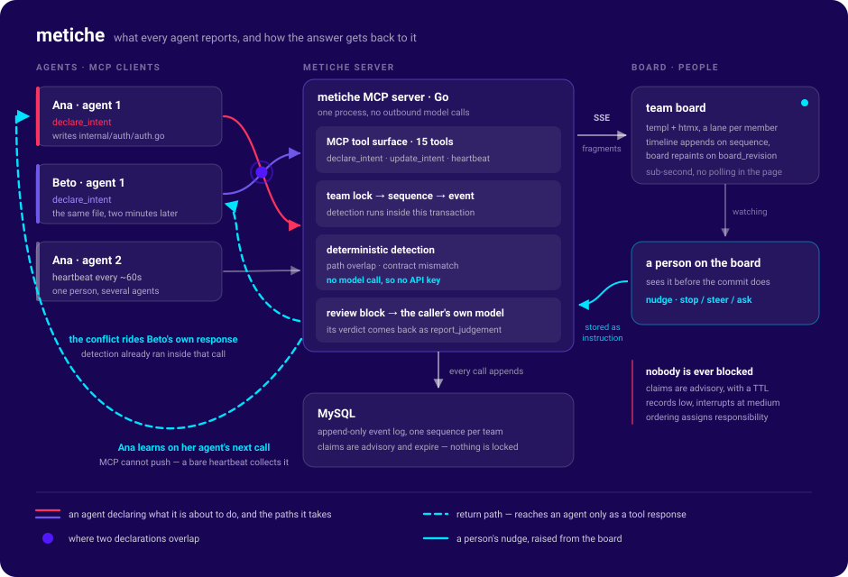

# metiche

**Mexican slang for "nosy".** An MCP server that every teammate's coding agent talks to, so
agents stop quietly working on the same thing.

---

## The problem

A small team — a hackathon team especially — collapses into a queue. Everyone ends up blocked on
one person, usually whoever owns the frontend, waiting to find out what they built and what shape
it came out in. Nothing lands in anyone else's world until it lands in git.

The work is parallelizable. The *awareness* is not.

Meanwhile everyone is running a coding agent that already knows, in plain language, exactly what
it is about to do — a second before it does it. That knowledge is sitting in five separate
terminals and nowhere else.

## What metiche is

metiche is an MCP server the whole team's agents connect to. Each agent continuously reports
what it is **about to do** and what it is **doing right now**. The server keeps that as shared
live team state, detects collisions, and tells the colliding agent **inside its own tool
response** — while it is still deciding, not after the merge conflict.

A Go web board shows the whole team live: a lane per person, their agents, each agent's current
intent, the paths it holds, and the conflicts it is in.

A team can be one human with three agents or five humans with two agents each. Both are normal
from day one.

## How it works



1. **Agents report.** Fifteen MCP tools, but three carry the day: `declare_intent` (what I'm about
   to do, and the paths I'm taking), `update_intent` (what I'm doing right now, and what I'm
   done with), and `heartbeat` (~every 60s: I'm alive, keep my claims, anything for me?).
   There is no separate "claim" verb — declaring an intent creates its claims in one transaction,
   so agents learn one concept instead of two.
2. **Git facts are self-reported.** Branch, base commit and paths come from the agent. No CLI to
   install, no git hooks, no server-side clone of your repo.
3. **Detection runs inside the call.** The write takes a per-team lock, appends to an append-only
   event log, and does detection in the *same* transaction — so there is no window where two
   agents both see a clean world. The later declarer is told synchronously; the earlier one gets
   an instruction that surfaces on its next call.
4. **Semantics are judged by the caller's own model.** The server never calls a model. It returns
   a small *review block* — a few candidate decisions and similar intents, each with a
   server-computed `pair_key` — and the agent's own model reads it and answers with
   `report_judgement`. The pair is assigned to exactly one agent, so N agents never burn N× tokens
   on the same question, and a judged pair never comes back unless one side materially changes.
5. **People watch and steer.** The board gets live updates over SSE. A person can raise a nudge
   (stop / steer / ask) or resolve a conflict. MCP has no push, so a nudge is stored as an
   instruction and rides the target agent's next call — a bare heartbeat is enough to collect it.

## The four collisions

### 1. Path overlap — deterministic

Ana declares `internal/auth/auth.go` for a write. Two minutes later Beto declares the same file
for the login UI, and his response says so before he has opened the editor.

Patterns are normalized on insert (no absolute paths, no `..`, trailing `/` becomes `**`) and
matched with real glob semantics, so `src/**` overlaps `src/api/user.go`. Severity comes from a
fixed matrix — read×read is never a conflict, write×read is medium, write×write on globs is high,
the identical exact path is critical, and a rename/move/delete against anything is high because
renames break readers silently — then deterministic adjusters: same person or same branch lowers
it, an over-broad claim is capped low and earns a "narrow this" nudge instead, and hotspot paths
(lockfiles, migrations, `go.mod`) raise it and carry a canned "regenerate after merge, don't
hand-resolve" note.

### 2. Contract mismatch — deterministic

An agent publishes what it **produces**; another publishes what it **consumes**. The server
canonicalizes each shape (sorted keys, closed type vocabulary, descriptions stripped) and hashes
it server-side — agents never compute the hash, or two agents describing the same shape would
produce different bytes and deduplication would evaporate.

One distinct hash means everybody agrees and the check is over in a single count — which is most
calls, and it needs to be, because it runs on the hot path. Otherwise a
directional comparison finds the four things that actually break a build: a required **out** field
the consumer needs and the producer omits, a required **in** field the producer needs and the
consumer omits, a type disagreement on a shared field, and naming variants (`user_id` vs `userId`)
which are usually just a serializer detail and stay low. Direction is load-bearing: it decides
which side is at fault. Near-miss keys are caught too — `/api/session` against `/api/sessions`.

#### The one that pays for the whole thing: nobody is building it

> A `consumes` assertion with no active `produces` behind it for more than five minutes.
>
> **"Beto is coding against an endpoint nobody is building."**

This is the highest-value signal in the system, and it is the one that hurts most at a hackathon.
Beto is forty minutes into a login screen wired to `POST /api/login`. Ana is building `/api/auth`
and doesn't know Beto exists yet. Nothing is broken, no test fails, no file is contested — the two
of them simply will not meet, and today nobody finds out until integration at hour ten.

metiche finds it for free out of the same tables: a consumer with no producer is a query, not a
judgement call. It shows up on the board's produces/consumes matrix as an empty column — which is
the view that shows a team its bottleneck — and it reaches Beto's agent as an actionable line
rather than an observation.

### 3. Decision contradiction — semantic

The team recorded `#auth-jwt-cookie`: *the session token lives in an httpOnly cookie, not in
localStorage.* An agent declares an intent that puts the token in localStorage. The decision ships
inline in that agent's review block, its own model reads both and reports a verdict, and the
verdict interrupts a human only at confidence ≥ 0.7 — because a model asked "is this a conflict?"
has a strong yes-bias.

### 4. Duplicate work — semantic, with a deterministic shortcut

Two agents on the same issue id is an exact match and the highest-signal duplicate key there is —
no model needed. Past that, candidates are found by shared contracts, sub-threshold path overlap
and token overlap, surfaced as similar intents, and judged by the caller's model once.

## Design decisions worth stating

**It never blocks anyone.** Claims are advisory and carry a TTL, with a hard cap that heartbeats
cannot push past, so a crashed agent's claims fall out of detection on their own. Overlap is
allowed; it just raises a conflict immediately. Ordering assigns *responsibility*, not permission:
whoever declared later is the one told synchronously, because they have the information in hand
and haven't started yet.

**The server never calls a model, so it never needs a key.** This is a public repo and anyone can
run it; requiring an LLM API key to start the thing would be a non-starter, and that single
constraint shapes the whole detection design. The server does only deterministic work — path
overlap, shape comparison, candidate retrieval — and hands the semantic questions back to the
model that is already running on the other end of the tool call. The one rule that protects this:
nothing in the coordination package may make an outbound HTTP call. A well-meaning contributor
*will* try ("let's just call a model to rank the decisions"), and it must be refused.

**"No credentials" is not "no auth".** A public repo means a public endpoint, and a team's board
is not public. Joining takes a team join code, which mints a per-agent bearer token server-side.
Do not remove this because the README says no keys are needed — that is about *third-party*
credentials. Never commit a join code or a token.

**Noise control is a feature, not a polish item.** A conflict system that cries wolf gets ignored,
and an agent that learns to ignore your tool output is unrecoverable. So: read×read never
conflicts; generated code never enters the claim table at all (codegen produces most of the Go
here, and without that rule every agent would collide with every other agent on generated CRUD);
one human's two agents are de-escalated and never interrupt; a pair is surfaced once, forever,
unless it escalates; review items are rate-limited per session; and **the record floor and the
notify floor are deliberately different** — findings are recorded at `low` and only interrupt
somebody at `medium`. Every surfaced conflict must carry a suggested next action: *"you and Ana
both hold auth.go"* is noise, *"Ana holds auth.go (write, 4m, feat/auth); consider consuming her
POST /api/login contract instead"* is signal. And dismissals feed back — a rule dismissed as a
false positive too often on a project demotes itself to record-only, with one-click re-enable.

**One datastore.** MySQL, no Redis, no message bus. Server-to-browser latency is an in-process
fan-out on commit plus a database tail as the cross-process backstop, which reads as instant.
Agent-to-agent latency has a floor no datastore can move — MCP is request/response, so an agent
learns things when it makes its next call — which is why the pending counts ride on every single
response. The capacity analysis, and the tripwires for when another layer would actually be
needed, are in [`docs/PLAN.md`](docs/PLAN.md).

## Running it yourself

### Prerequisites

| | |
|---|---|
| **Go** | 1.26 or newer (`go.mod` targets 1.26; the board module pins 1.26.2) |
| **MySQL** | 8.0 or newer, for the server. The board alone needs no database. |
| **An MCP-capable coding agent** | for the client side — anything that can add an MCP server |
| **`templ` CLI** | only if you edit `.templ` files; generated files are committed |
| **A third-party API key** | **never.** No model provider, no account, no hosted service. |

### Configuration

Settings are supplied as environment variables or a config file mounted at runtime; nothing
sensitive lives in the repo, and `.gitignore` is written to keep it that way (overlay configs,
credential files, keys, kubeconfigs). What the design fixes today:

- **A MySQL connection.** One database that metiche owns.
- **`METICHE_ROLE`.** The server can run as one process serving everything (`all`, the intended v1
  shape) — the role split exists for later, when agent load needs isolating from the board.
- **Two HTTP surfaces.** The MCP endpoint agents connect to, and the web/API surface that serves
  the board and its SSE stream. They can be the same process and different hostnames.
- **Per-project tuning lives in the database, not in config**: ignore patterns (which generated
  paths never count as collisions) and hotspot patterns (which paths escalate) are project rows,
  editable without a redeploy.
- **No third-party credential of any kind**, and no outbound network access is required for
  detection to work.

The concrete variable names land with the server itself, which is not written yet — see
[Status](#status).

### Run it locally

**The board, right now**, against recorded fixture streams — no database, no backend, no
arguments:

```sh
cd code/frontend
go run ./cmd/metiche-web
# → http://localhost:8787
```

It replays a recorded team story, so the board is populated the moment it opens. `/t/demo` is the
board, plus `/t/demo/graph`, `/t/demo/contracts`, `/t/demo/conflicts`, `/t/demo/decisions` and
`/t/demo/runs`. Useful flags: `-addr`, `-speed`, `-warmup`, `-loop`, `-fixtures <dir>` to replay
your own recordings, and `-backend <url>` to point it at a real server once there is one. See
[`code/frontend/README.md`](code/frontend/README.md).

**The detection core**, which is pure functions with no database and no generated code:

```sh
cd code/backend/coordination
go test ./...
```

**The MCP server itself is not runnable yet** — there is no `go run` for it, because the schema,
the generated backend and the tool surface have not landed. When they do, joining will be: point
your agent at the server's MCP endpoint, then hand `join_team` your team's join code, which mints
that agent its own token. A `.mcp.json` and a Claude Code plugin are planned so this is one
command rather than a config exercise.

Never commit a join code or a token — not in `.mcp.json`, not in an example, not in a screenshot.

### Deploy it

metiche is deliberately boring to host. What it needs, in full:

- **One Go binary.** Stateless apart from its in-process SSE fan-out, so a single replica is the
  intended shape to start; run it under systemd, in a container, or as a Deployment — it does not
  care.
- **One MySQL 8 database** it owns, with normal durable storage. This is the only stateful part.
- **Two HTTP surfaces** exposed: the MCP endpoint for agents, and the board plus its
  `text/event-stream` endpoint for browsers.
- **TLS in front, with long proxy timeouts.** The SSE stream is a long-lived response: whatever
  terminates TLS must not buffer it and must not cut idle connections after 30 or 60 seconds.
  In nginx that is `proxy_buffering off` and a large `proxy_read_timeout`; on a cloud load
  balancer it is the idle timeout; the equivalent knob exists in Caddy, Traefik and Envoy. Getting
  this wrong is the single most likely way to make a correct deployment look broken.
- **Config supplied from outside the repo** — environment variables, a mounted file, a secret
  manager, whatever your platform does. Nothing needs to be baked into an image.
- **No egress.** Nothing phones home and nothing calls a model provider.

That list is the whole contract, so a laptop, a single VPS, a `docker-compose` file with two
services, or Kubernetes all work equally well. Kubernetes with a Helm chart is one option among
those, not the blessed path — charts are planned under `deploy/` and are not written yet.

## Project layout

```
metiche/
  code/
    backend/
      coordination/        pure detection functions + tests    ← built
      metiche/             generated backend, hand-written app/ ← not yet
    frontend/              the board: Go, templ + htmx + SSE   ← built (fixture-driven)
  skill/metiche-teamwork/  the skill that teaches an agent the cadence  ← not yet
  plugin/                  Claude Code plugin wrapping the skill + MCP config  ← not yet
  deploy/                  charts, scripts, schema             ← not yet
  docs/
    PLAN.md                the full design: data model, detection, tool surface, realtime
    architecture.svg       the diagram above
```

## Status

**Early. Nothing is deployed and there are no users.** Two pieces are real:

- **`code/backend/coordination`** — path normalization, ancestor/prefix computation, glob overlap,
  the severity matrix and its adjusters, dedupe keys, shape canonicalization and stable hashing,
  the directional field comparison, key distance, and revision-scoped `pair_key`. Table-driven
  tests, no database required, `go test ./...` green. It is a temporary standalone module; it
  folds into the backend module once the generated tree exists.
- **`code/frontend`** — the board, entanglement graph, contracts matrix, conflicts, decisions and
  run history, rendering live from recorded fixtures over the real SSE mechanism. The seam for the
  live backend exists and is one flag.

Not built yet: the schema and the generated backend, the MCP server and all fifteen tools, MySQL
persistence, the TTL sweeper, the live event stream from the backend, the skill and plugin, and
the deploy charts. The plan for every one of those is in [`docs/PLAN.md`](docs/PLAN.md), which is
the spec this README summarizes.

## License

[Apache License 2.0](LICENSE).

Permissive, so a team can run metiche inside a company without a licence review turning into a
blocker — which matters more here than usual, because a coordination tool only works when
*everyone* on the team installs it. Apache rather than MIT for the explicit patent grant.
